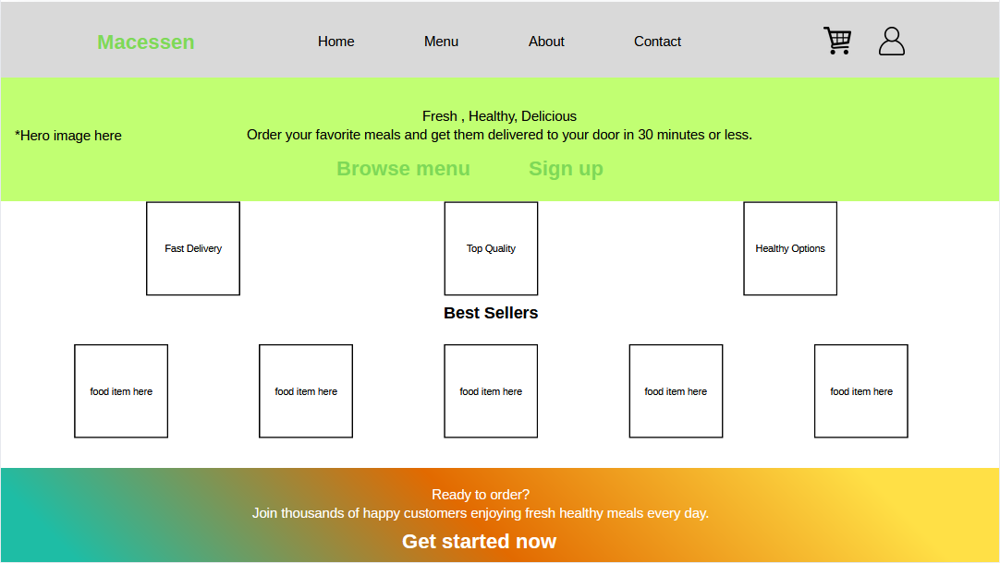
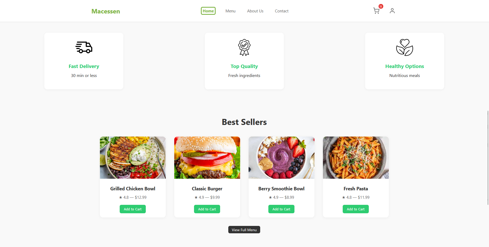
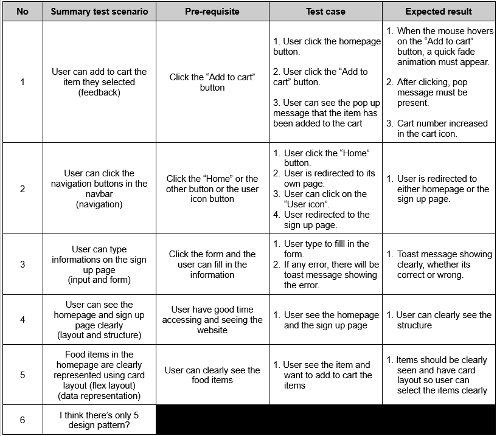
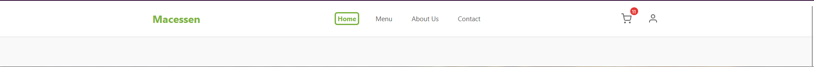
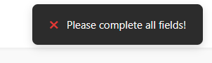

# HCI-Quiz-2

Name: Muhammad Dafi Arib Asyrofi

ID: 2902718944

This is the original page.

This is the improvement page, I changed several things to make it look better as the homepage.

This is the evaluation table:

This is the rest of the homepages and sign up pages based on the evaluation page:

# This is the sign up page, i decided to add form validation here so it look good.

# This is the data representation, i made this into a cart layout and flex css so it looks clear.

# Navbar is updated as well, to make it look clean.

# In case any successful or errors, there is always a message, when adding to cart, filling the informations, and etc.

live page link: https://dafz-7.github.io/HCI-Quiz-2/

github link: https://github.com/Dafz-7/HCI-Quiz-2